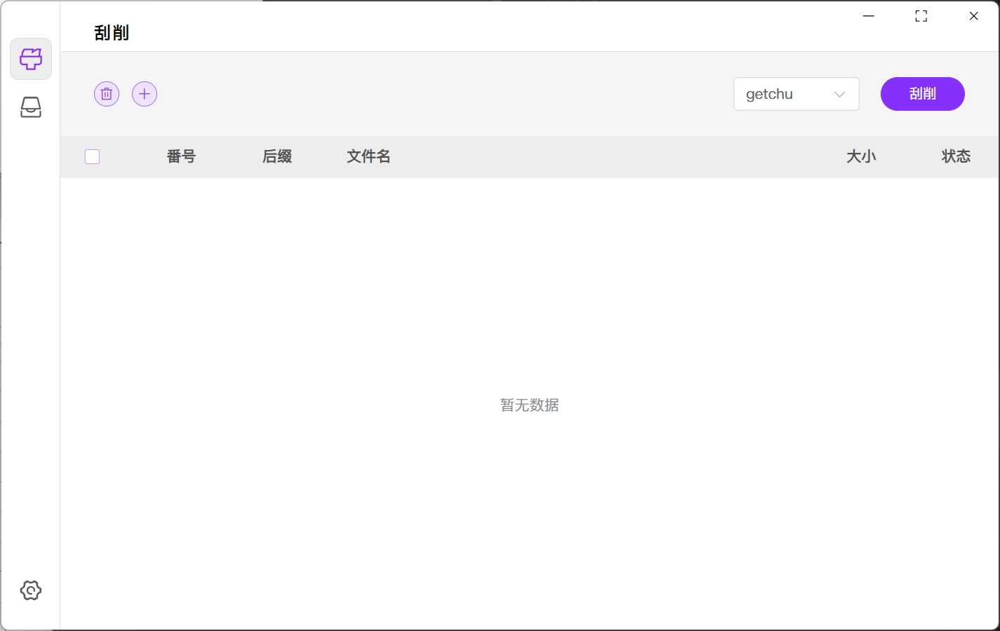

# JapaneseLearning-Capture

日语学习资料管理器，可管理日语词汇、语法解释、听力练习、阅读材料等。用于提高日语阅读、口语、听力水平，以应对JLPT（日本语能力测试）。祝各位早日考过N1、N2，加油！


## 声明

- 本项目不提供任何视频下载，只管理本地资源

- 本项目和项目成果仅供技术，学术交流和electron性能测试使用
- 本项目贡献者编写该项目旨在学习electron，提高编程水平
- 如有问题可在issue提出
- 永久全部开源免费


## 预览

<p align='center'></p>


## 手动打包

```bash
npm install
npm run web-build
npm run build-package
```

遇到网络问题可以开梯子，还有问题开tun模式
